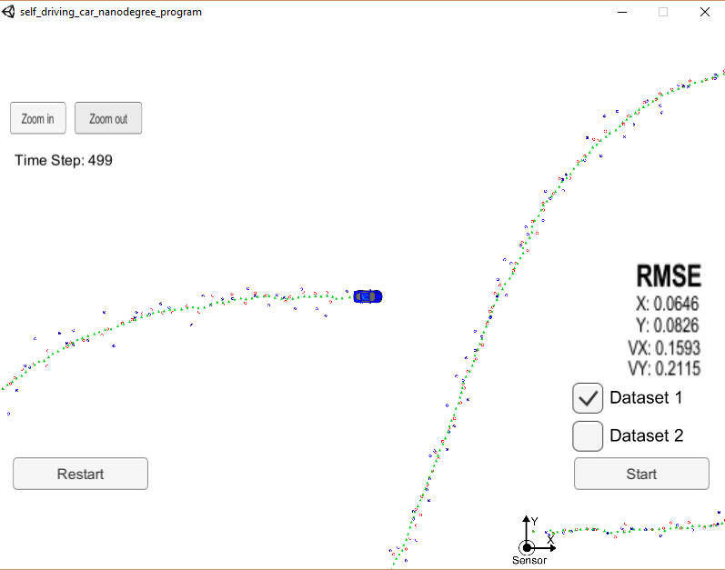
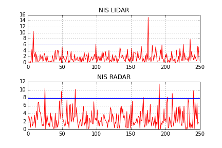

# Unscented Kalman Filter Project

## Overview
This repository contains the work I did within **Project #7 of Udacity's Self-Driving Car Nanodegree Program** (second project of second term). Project is very similar to  project #6, the difference being that we will here utilize an unscented kalman filter (UKF) instead of an EKF, to estimate the state (position / velocity) of a moving object of interest (for instance, bicycle in the vicinity of a car) with noisy lidar and radar measurements. 

For this Udacity provides us with a car driving simulator it has developed. It can be downloaded [here](https://github.com/udacity/self-driving-car-sim/releases).

## Repository content

The repository includes the following files:

 - source code in the */src* folder
	 - main.cpp : communicates with the Simulator receiving data measurements, calls a function to run the Kalman filter, calls a function to calculate RMSE, writes the results to an output text file
	 - UKF.h & UKF.cpp:  initializes the filter, calls and defines the predict function, calls and defines the update functions for both Lidar and Radar
 	 - tools.h & .cpp: function to calculate RMSE
 	 - measurement_package.h: defines a class to be used to store measurements
 	 - json.hpp: JSON is used for communication with simulator
 - /data: a folder containing a data file for testing the UKF (actually the data which the simulator interface provides). It contains radar / lidar measurements and true vehicle state (2D-position and 2D-velocity). There are 500 measurements (lidar and radar measurements alternatively). Timestep is 50 ms.
 - CMakeLists.txt: file that is used for compiling code

[Here](https://discussions.udacity.com/t/getting-started-with-docker-and-windows-for-the-ekf-project-a-guide/320236]) is a link which details how to have the simulator and code run with Docker on Windows.

## Results

The figure below represents the simulator. The car represents the true position of the tracked object. Lidar measurements are represented by red circles, radar measurements by blue circles with an arrow pointing in the direction of the observed angle, and UKF position estimation by green triangles. We can see that UKF makes a good job in filtering radar and lidar measurements.

On the right and side of the simulator, values of RMSE (root mean square error) for position (x,y) and velocity (vx,vy) are displayed. Here they are the results of processing both radar and lidar measurements. 
I also provide the performance of the UKF with radar-only and  lidar-only measurements. Final RMSE are given in the table below:

|Type / RMSE|Px|Py |Vx |Vy|
|:--------:|:----:|:----:|:----: |:----: |
|Radar only|0.145|0.213|0.186|0.279|
|Lidar only|0.089|0.096|0.208|0.224|
|Radar+Lidar|0.065|0.083|0.159|0.212|

Below we recall the performance obtained with the EKF (cf. [P6-ExtendedKalmanFilter project](link))
|Type / RMSE|Px|Py |Vx |Vy|
|:--------:|:----:|:----:|:----: |:----: |
|Radar only|0.23|0.34|0.58|0.80|
|Lidar only|0.14|0.12|0.63|0.53|
|Radar+Lidar|0.09|0.09|0.45|0.43|

And in the table below we provide the accuracy improvement in %.
|Type / RMSE|Px|Py |Vx |Vy|
|:--------:|:----:|:----:|:----: |:----: |
|Radar only|37.0|37.4|68.0|65.0|
|Lidar only|36.4|20.0|67.0|58.7|
|Radar+Lidar|27.8|7.8|64.7|50.7|

We see that improvement is really significant, especially for the velocity with improvement up to 65%.
The added-value of UKF is more important on LIDAR-only or RADAR-only based KF than on mixed KF.

## Consistency check

One way to check that the "tuning" of the KF is correct (in particular the setting of the process noise covariance) is to plot the Normalized Innovation Squared (NIS) and compare it to a predefined threshold.
The NIS is a function of the innovation (which is equal to the predicted measurement zk+1|k minus the measurement z) and the covariance of the innovation (see [link](https://www.ncbi.nlm.nih.gov/pmc/articles/PMC4239867/) for explanation). This quantity is expected to follow a chi-squared distribution.
To check if it really is the case, we plot NIS and the 95th-centile of the chi-2 distribution. This latter value depends on the number of degrees of freedom (dof) of the variable, which is equal to the size of the innovation vector. Here the number of dof is equal to 2 for lidar measurements and 3 for radar measurements. The thresholds are then equal to 5.991 and 7.815 respectively (see [here](https://www.medcalc.org/manual/chi-square-table.php) for values).
The result is correct if roughly 5% of the values are greater than the threshold.
On the figure below, we plot the NIS for both Lidar and Radar.

We obtain that respectively 2% and 3.2% of measurements are above the 95% threshold, which is not that far from the expected 5%. Being a little below means that the innovation covariance is a little bit overestimated.
Thus we could further improve the performance of the UKF by reducing a bit the process noise. 
